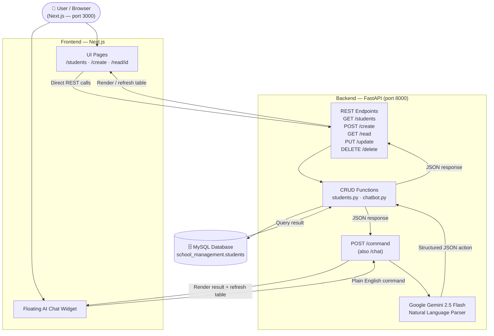
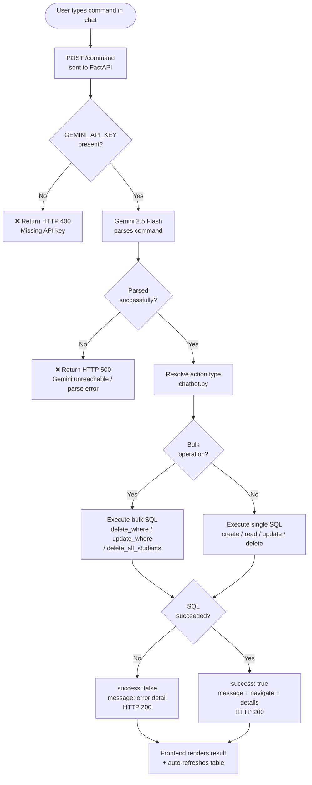
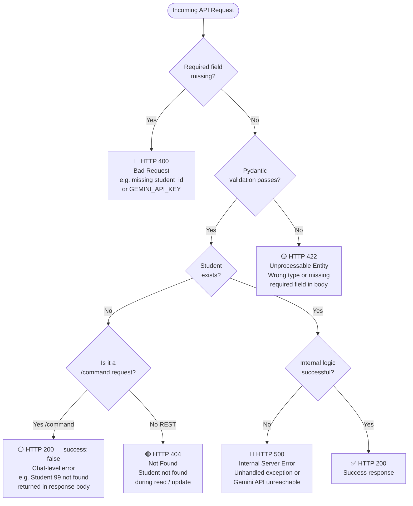

# Ira-FastAPI — Student Management System

A full-stack student management application with a **Next.js** frontend, **FastAPI** backend, and **MySQL** database. Includes an AI-powered floating chat assistant that accepts natural language commands and executes CRUD operations in real time.

---

## Table of Contents

1. [Project Overview](#1-project-overview)
2. [Tech Stack](#2-tech-stack)
3. [Project Structure](#3-project-structure)
4. [Installation & Setup](#4-installation--setup)
5. [Environment Variables](#5-environment-variables)
6. [API Documentation](#6-api-documentation)
7. [AI Chat Interface](#7-ai-chat-interface)
8. [Database](#8-database)
9. [Frontend Pages](#9-frontend-pages)
10. [Error Handling](#10-error-handling)
11. [Assumptions & Limitations](#11-assumptions--limitations)

---

## 1. Project Overview

Ira-FastAPI is an admin portal for managing student records. The core workflow:

- View, search, create, edit, and delete students through a clean web UI
- Use the **floating AI assistant** on the students page to perform any operation in plain English
- The backend parses natural language via **Google Gemini**, executes the right SQL, and returns a structured response the frontend renders instantly

### Architecture

```
Next.js (port 3000)
      │
      │  HTTP / REST
      ▼
FastAPI (port 8000)
      │
      ├── /students, /create, /read, /update, /delete  ← direct REST
      └── /command  ← natural language → Gemini → CRUD
              │
              ▼
         MySQL Database
```

### Architecture Flowchart



### Key Features

| Feature | Detail |
|---|---|
| Student CRUD | Create, read, update, delete via REST or AI chat |
| Bulk operations | Delete all, delete by filter, update by filter via chat |
| AI chat | Floating widget — natural language → Gemini → SQL |
| Live table refresh | Table auto-updates after every chat mutation |
| Search | Client-side filter by name, grade, or ID |
| Partial updates | Chat merges only changed fields; existing fields preserved |

---

## 2. Tech Stack

| Layer | Technology |
|---|---|
| Frontend | Next.js 14 (App Router, JSX) |
| Backend | FastAPI (Python) |
| Database | MySQL |
| DB Driver | `mysql.connector` (no ORM, raw SQL) |
| AI Parser | Google Gemini 2.5 Flash via `google-genai` |
| Styling | Inline styles + Tailwind utility classes |

---

## 3. Project Structure

```
Ira-FastAPI/
├── backend/
│   ├── main.py                  # FastAPI app, routes, CORS, error handlers
│   ├── database.py              # MySQL connection
│   ├── requirements.txt
│   ├── .env                     # DB password + Gemini key (not committed)
│   ├── functions/
│   │   ├── students.py          # CRUD SQL functions
│   │   ├── parser.py            # Gemini LLM parser
│   │   └── chatbot.py           # Command handler (routing + bulk ops)
│   └── schema/
│       └── student.py           # Pydantic Student model
│
└── my-app/
    ├── app/
    │   ├── page.js              # Landing page
    │   ├── layout.js
    │   ├── students/page.jsx    # Main dashboard + floating AI chat
    │   ├── create/page.jsx      # Create student form
    │   └── read/[id]/page.jsx   # Student detail / edit / delete
    ├── components/
    │   └── ui/table.jsx
    ├── lib/utils.js
    └── package.json
```

---

## 4. Installation & Setup

### Prerequisites

- Python 3.10+
- Node.js 18+
- MySQL 8+

---

### Backend

```bash
cd backend
python -m venv venv

# Activate
source venv/Scripts/activate      # Mac / Linux / WSL
.\venv\Scripts\Activate.ps1       # PowerShell
venv\Scripts\activate             # CMD

pip install -r requirements.txt
```

Create `.env` (see [Environment Variables](#5-environment-variables)), set up MySQL (see below), then:

```bash
uvicorn main:app --reload --host 0.0.0.0 --port 8000
```

---

### MySQL Setup

```sql
CREATE DATABASE IF NOT EXISTS school_management;
USE school_management;

CREATE TABLE students (
  id       INT PRIMARY KEY AUTO_INCREMENT,
  roll_no  VARCHAR(255) NOT NULL UNIQUE,
  name     VARCHAR(255) NOT NULL,
  age      INT          NOT NULL,
  grade    VARCHAR(100) NOT NULL,
  address  VARCHAR(255) NOT NULL
);
```

---

### Frontend

```bash
cd my-app
npm install
npm run dev
```

App runs at `http://localhost:3000`.

---

## 5. Environment Variables

Create `backend/.env`:

```env
DATABASE_PASSWORD=your_mysql_password
GEMINI_API_KEY=your_gemini_api_key
```

| Variable | Required | Description |
|---|---|---|
| `DATABASE_PASSWORD` | Yes | MySQL password used in `database.py` |
| `GEMINI_API_KEY` | Yes | Google Gemini API key for the AI parser |

> The frontend API base URL is hard-coded as `http://localhost:8000`. To change it, update `API_BASE` at the top of `students/page.jsx` and `read/[id]/page.jsx`.

---

## 6. API Documentation

Base URL: `http://localhost:8000`

---

### `GET /`
Health check.
```json
{ "message": "Hello World" }
```

---

### `POST /create`
Create a student.

**Body:**
```json
{
  "roll_no": "A101",
  "name": "Laksh",
  "age": 18,
  "grade": "10",
  "address": "Vasai"
}
```

**Response:**
```json
{ "message": "Student created successfully" }
```

---

### `GET /read?student_id=1`
Read a student by ID.

**Response (found):**
```json
{ "id": 1, "roll_no": "A101", "name": "Laksh", "age": 18, "grade": "10", "address": "Vasai" }
```

**Response (not found):**
```json
{ "message": "Student not found" }
```

---

### `PUT /update`
Full update — all fields required.

**Body:**
```json
{ "id": 1, "roll_no": "A101", "name": "Laksh", "age": 19, "grade": "11", "address": "Virar" }
```

**Response:**
```json
{ "message": "Student updated successfully" }
```

> For partial updates (change only one field), use `/command` instead.

---

### `DELETE /delete?student_id=1`
Delete a student.

```json
{ "message": "Student deleted successfully" }
```

---

### `GET /students`
List all students.

```json
[
  { "id": 1, "roll_no": "A101", "name": "Laksh", "age": 18, "grade": "10", "address": "Vasai" },
  ...
]
```

---

### `POST /command`
Natural language command → Gemini → CRUD → response.

Also aliased as `POST /chat` for backward compatibility.

**Body:**
```json
{ "command": "delete all students with grade F" }
```

**Response:**
```json
{
  "success": true,
  "message": "Deleted 3 students where grade=F",
  "navigate": { "path": "/students" },
  "details": [
    {
      "function": "delete_where",
      "success": true,
      "message": "Deleted 3 students where grade=F",
      "result": { "deleted": 3 }
    }
  ]
}
```

---

## 7. AI Chat Interface

The floating chat widget lives in the bottom-right corner of the `/students` page.

### How it works

```
User types command
      │
      ▼
POST /command
      │
      ▼
parser.py → Gemini 2.5 Flash
      │      (returns structured JSON action)
      ▼
chatbot.py → resolve action → SQL
      │
      ▼
{ success, message, navigate, details }
      │
      ▼
Frontend renders result + refreshes table
```

### AI Chat Flow (Yes/No Decision Flowchart)



### Supported operations

| What you say | What happens |
|---|---|
| `Create student roll A101 name Laksh age 18 grade 10 address Vasai` | Creates one student |
| `Create Alice 17 grade B Pune and Bob 18 grade A Delhi` | Creates two students |
| `Show student 1` | Reads student #1, shows detail card |
| `Read students 1, 2 and 3` | Reads three students |
| `Update student 1 grade to A` | Partial update — only grade changes |
| `Update Laksh's address to Mumbai` | Updates by name match |
| `Update all grade B students to grade A` | Bulk update by filter |
| `Set everyone's address to Delhi` | Updates all students |
| `Delete student 3` | Deletes one student |
| `Delete students 4 and 5` | Deletes two students |
| `Delete all students with grade F` | Bulk delete by filter |
| `Delete students from Mumbai` | Bulk delete by address |
| `Delete student named Riya` | Delete by name |
| `Delete all students` | Clears entire table |
| `Show all students` | Lists all with count |
| `Show students with grade A` | Filters by grade |
| `List students from Mumbai` | Filters by address |

### Supported functions (internal)

| Function | Triggered by |
|---|---|
| `create_student` | Single create |
| `read_student` | Single read by ID |
| `update_student` | Single update by ID |
| `delete_student` | Single delete by ID |
| `all_students` | List all |
| `filter_students` | Read with filter |
| `update_where` | Bulk update matching filter |
| `delete_where` | Bulk delete matching filter |
| `delete_all_students` | Delete entire table |

### Chat response format

Each response includes a `details` array — one entry per operation:

```json
{
  "function": "create_student",
  "success": true,
  "message": "Student created successfully",
  "navigate": { "path": "/students" },
  "result": { ... }
}
```

The UI shows only what matters: a color-coded operation label + one line of outcome text. Student cards are shown only for read/filter results.

---

## 8. Database

### Table: `students`

| Column | Type | Constraints |
|---|---|---|
| `id` | INT | Primary key, auto-increment |
| `roll_no` | VARCHAR(255) | Not null, unique |
| `name` | VARCHAR(255) | Not null |
| `age` | INT | Not null |
| `grade` | VARCHAR(100) | Not null |
| `address` | VARCHAR(255) | Not null |

- Single table, no foreign keys
- All fields required for REST endpoints
- Chat-based updates read existing record first and merge only the changed fields

---

## 9. Frontend Pages

| Route | Purpose |
|---|---|
| `/` | Landing page |
| `/students` | Student table with search, stats, and floating AI chat widget |
| `/create` | Form to add a new student |
| `/read/[id]` | Student detail view with inline edit and delete |

### `/students` page behaviour

- Fetches all students on mount
- Client-side search filters by name, grade, or ID
- Clicking any table row navigates to `/read/[id]`
- After any chat mutation (create / update / delete), the table re-fetches automatically
- Stats strip shows total count and currently visible count

---

## 10. Error Handling

### Error Type Flowchart



### Error Reference Table

| Status | Scenario |
|---|---|
| `400` | Missing required field (e.g. `student_id` for delete) |
| `404` | Student not found during update or read |
| `422` | Pydantic validation failure — missing or wrong-type fields |
| `500` | Unhandled exception or missing `GEMINI_API_KEY` |

Chat-specific errors return HTTP 200 with `success: false`:

```json
{
  "success": false,
  "message": "Student 99 not found",
  "navigate": null,
  "details": [...]
}
```

---

## 11. Assumptions & Limitations

- No authentication or authorization is implemented
- No database migration tooling — schema must be created manually
- Frontend API base URL (`http://localhost:8000`) is hard-coded; change `API_BASE` in page files before deploying
- `PUT /update` requires all fields; partial updates only via `/command`
- The `/command` endpoint requires a valid `GEMINI_API_KEY` — it will return 400 if the key is missing or the Gemini API is unreachable
- No rate limiting on the `/command` endpoint
- Bulk operations (`delete_all_students`, `delete_where`, `update_where`) execute individual SQL calls in a loop — not wrapped in a transaction
