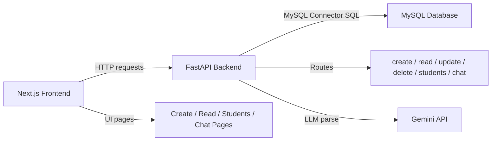
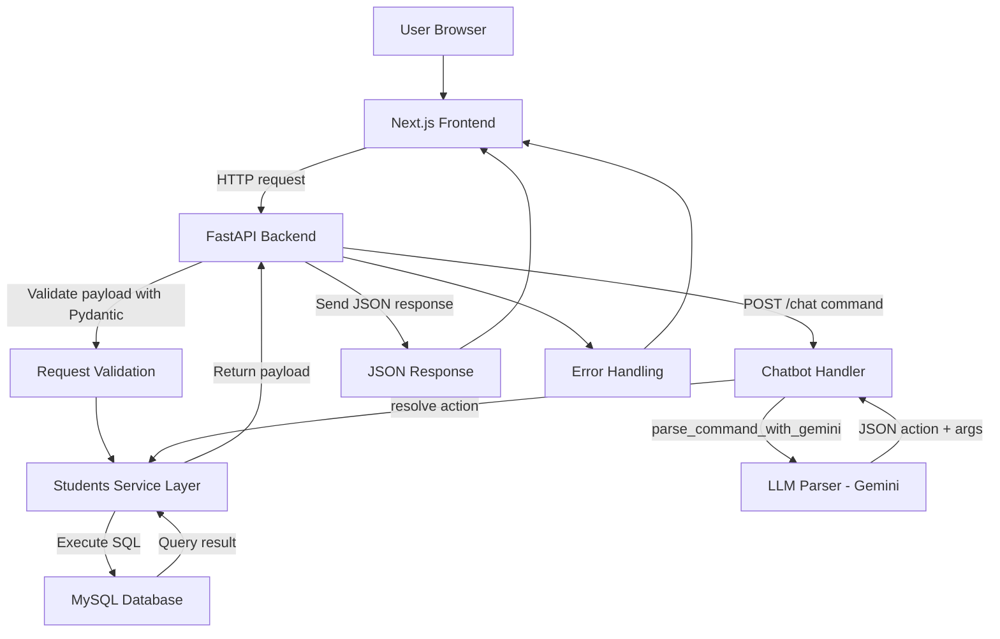
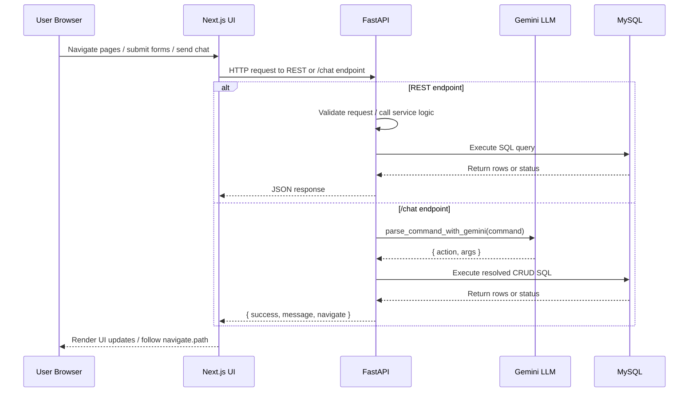
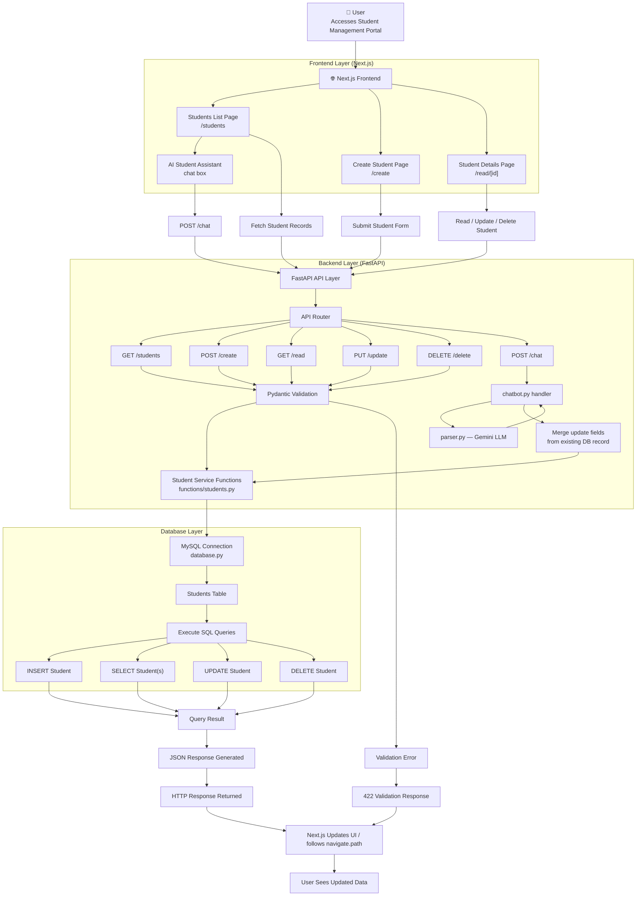
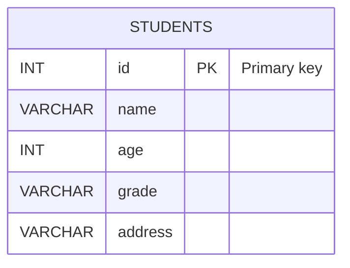

# Ira-FastAPI — Student Management System

A full-stack student management application built with a **Next.js** frontend, **FastAPI** backend, and **MySQL** database. The application enables creating, reading, updating, deleting, and listing student records through a responsive web interface — including an **AI-driven chat interface** that parses natural language commands and executes CRUD operations automatically.

---

## Table of Contents

- [Project Overview](#1-project-overview)
- [Tech Stack](#2-tech-stack)
- [Project Structure](#3-project-structure)
- [Installation & Setup](#4-installation--setup)
- [Environment Variables](#5-environment-variables)
- [Application Workflow](#6-application-workflow)
- [API Documentation](#7-api-documentation)
- [Complete API Inventory](#8-complete-api-inventory)
- [Frontend Pages & Components](#9-frontend-pages--components)
- [Database Documentation](#10-database-documentation)
- [Authentication & Authorization](#11-authentication--authorization)
- [Error Handling](#12-error-handling)
- [AI Chat Interface](#13-ai-chat-interface)
- [Assumptions & Limitations](#14-assumptions--limitations)
- [Postman Collection](#15-postman-collection)
- [Submission Readiness Checklist](#16-submission-readiness-checklist)

---

## 1. Project Overview

`Ira-FastAPI` demonstrates a simple administrative interface for managing student details with:

- A responsive Next.js UI for student listing, creation, detail editing, and AI-powered chat.
- A FastAPI backend exposing REST endpoints for CRUD operations and a `/chat` endpoint for natural language commands.
- A MySQL database for persistent student storage.
- An LLM-based parser (Google Gemini) that interprets chat commands and maps them to student CRUD operations.

### High-level Architecture



### Detailed Application Flowchart



### Key Features

- Frontend student dashboard with search and navigation
- Create student records via form submission
- Read student details by ID
- Update student data in-place (partial merge supported via chat)
- Delete student records
- List all students from the database
- **AI chat interface** — natural language commands mapped to CRUD via Gemini LLM
- **Auto-navigation** — chat responses include `navigate.path` for automatic frontend routing
- FastAPI validation using Pydantic
- CORS enabled for frontend-backend access

---

## 2. Tech Stack

| Layer | Technology |
|---|---|
| Frontend | Next.js (JSX) |
| Backend | FastAPI |
| Database | MySQL |
| ORM / Database Layer | Direct SQL via `mysql.connector` (no ORM) |
| LLM / AI Parser | Google Gemini (`google.genai` client) |
| Authentication | Not implemented |
| Deployment | Not implemented |

---

## 3. Project Structure

```
Ira-FastAPI/
├── backend/
│   ├── database.py
│   ├── main.py
│   ├── requirements.txt
│   ├── .env                        # local (not checked in) — DB + Gemini keys
│   ├── functions/
│   │   ├── __init__.py
│   │   ├── students.py             # CRUD SQL functions
│   │   ├── parser.py               # LLM parser (google.genai / Gemini)
│   │   └── chatbot.py              # Chat command handler and navigation hints
│   └── schema/
│       └── student.py
├── my-app/
│   ├── app/
│   │   ├── create/page.jsx
│   │   ├── read/[id]/page.jsx
│   │   ├── students/page.jsx       # Contains AI Student Assistant chat box
│   │   ├── page.js
│   │   └── layout.js
│   ├── components/
│   │   └── ui/table.jsx
│   ├── lib/
│   │   └── utils.js
│   ├── next.config.mjs
│   ├── package.json
│   ├── package-lock.json
│   ├── postcss.config.mjs
│   └── README.md
├── PostmanCollection.json
└── README.md
```

### Folder Purposes

| Path | Purpose |
|---|---|
| `backend/` | FastAPI backend application source and database connectivity |
| `backend/main.py` | FastAPI app, route definitions, CORS middleware, and validation error handling |
| `backend/functions/students.py` | CRUD functions, SQL query execution, and MySQL interaction |
| `backend/functions/parser.py` | LLM parser — calls Gemini to extract action and arguments from natural language |
| `backend/functions/chatbot.py` | Chat handler — resolves parsed actions, merges update fields, returns `{ success, message, navigate }` |
| `backend/schema/student.py` | Pydantic `Student` schema for request validation |
| `backend/database.py` | MySQL connection and cursor configuration |
| `backend/requirements.txt` | Python dependencies |
| `backend/.env` | Environment variables (not checked in) |
| `my-app/` | Next.js frontend application |
| `my-app/app/` | Next.js page routes and UI screens |
| `my-app/components/ui/table.jsx` | Reusable table UI component |
| `my-app/lib/utils.js` | Utility helper for class name merging |
| `my-app/package.json` | Frontend dependencies and scripts |

---

## 4. Installation & Setup

### Backend Setup

**Requirements:** Python 3.10 or later

```bash
cd d:\Ira-FastAPI\backend
python -m venv venv
```

Activate the virtual environment:

```bash
# PowerShell
.\venv\Scripts\Activate.ps1

# Bash / WSL
source venv/Scripts/activate

# Command Prompt
venv\Scripts\activate
```

Install dependencies:

```bash
pip install -r requirements.txt
```

Create a `.env` file (see [Environment Variables](#5-environment-variables)), set up the database (see [MySQL Setup](#mysql-setup) below), then start the server:

```bash
uvicorn main:app --reload --host 0.0.0.0 --port 8000
```

The API will be available at `http://localhost:8000`.

---

### Frontend Setup

**Requirements:** Node.js 18 or later

```bash
cd d:\Ira-FastAPI\my-app
npm install
npm run dev
```

The app will be available at `http://localhost:3000`.

---

### MySQL Setup

Create the database and table manually:

```sql
CREATE DATABASE IF NOT EXISTS school_management;
USE school_management;

CREATE TABLE students (
  id      INT PRIMARY KEY,
  name    VARCHAR(255) NOT NULL,
  age     INT NOT NULL,
  grade   VARCHAR(100) NOT NULL,
  address VARCHAR(255) NOT NULL
);
```

Update the connection settings in `backend/database.py` to match your credentials, or set them via `.env`:

```python
host     = "localhost"
user     = "your_user"
password = os.getenv("DATABASE_PASSWORD")
database = "school_management"
```

---

## 5. Environment Variables

Create a `.env` file inside `backend/` containing:

```env
DATABASE_PASSWORD=your_db_password
GEMINI_API_KEY=your_gemini_api_key
```

| Variable | Required | Description |
|---|---|---|
| `DATABASE_PASSWORD` | Yes | Password used by `backend/database.py` to connect to MySQL |
| `GEMINI_API_KEY` | Yes (for `/chat`) | API key for Google Gemini — used by `backend/functions/parser.py` |

> **Note:** If `GEMINI_API_KEY` is not provided, the parser will raise an exception when `/chat` is called. You can stub or replace `parse_command_with_gemini` in `parser.py` if you want a non-LLM fallback.

### Frontend

The frontend uses hard-coded `http://localhost:8000` as the API base URL. Move this to a `.env.local` file before deploying:

```env
NEXT_PUBLIC_API_URL=http://localhost:8000
```

---

## 6. Application Workflow



### Full System Flowchart



---

## 7. API Documentation

Base URL: `http://localhost:8000`

---

### `GET /`

Health check endpoint.

**Response:**
```json
{ "message": "Hello World" }
```

**Sample request:**
```bash
curl http://localhost:8000/
```

---

### `POST /create`

Create a new student record.

**Request body:**
```json
{
  "id": 1,
  "name": "Jane Doe",
  "age": 18,
  "grade": "12",
  "address": "123 Main St"
}
```

**Response:**
```json
{ "message": "Student created successfully" }
```

**Sample request:**
```bash
curl -X POST http://localhost:8000/create \
  -H "Content-Type: application/json" \
  -d '{"id": 1, "name": "Jane Doe", "age": 18, "grade": "12", "address": "123 Main St"}'
```

---

### `GET /read`

Retrieve a single student record by ID.

**Query parameters:**

| Parameter | Type | Required |
|---|---|---|
| `student_id` | int | Yes |

**Response (found):**
```json
{
  "id": 1,
  "name": "Jane Doe",
  "age": 18,
  "grade": "12",
  "address": "123 Main St"
}
```

**Response (not found):**
```json
{ "message": "Student not found" }
```

**Sample request:**
```bash
curl "http://localhost:8000/read?student_id=1"
```

---

### `PUT /update`

Update an existing student record. All fields must be supplied (for partial updates, use `/chat`).

**Request body:**
```json
{
  "id": 1,
  "name": "Jane Doe",
  "age": 19,
  "grade": "12",
  "address": "456 Elm St"
}
```

**Response:**
```json
{ "message": "Student updated successfully" }
```

**Sample request:**
```bash
curl -X PUT http://localhost:8000/update \
  -H "Content-Type: application/json" \
  -d '{"id": 1, "name": "Jane Doe", "age": 19, "grade": "12", "address": "456 Elm St"}'
```

---

### `DELETE /delete`

Delete a student record by ID.

**Query parameters:**

| Parameter | Type | Required |
|---|---|---|
| `student_id` | int | Yes |

**Response:**
```json
{ "message": "Student deleted successfully" }
```

**Sample request:**
```bash
curl -X DELETE "http://localhost:8000/delete?student_id=1"
```

---

### `GET /students`

Retrieve all student records.

**Response:**
```json
[
  {
    "id": 1,
    "name": "Jane Doe",
    "age": 18,
    "grade": "12",
    "address": "123 Main St"
  }
]
```

**Sample request:**
```bash
curl http://localhost:8000/students
```

---

### `POST /chat`

Accept a natural language command, parse it with the Gemini LLM, execute the resolved CRUD action, and return a concise response with a navigation hint.

**Request body:**
```json
{ "command": "Create student id 2 name Alice age 17 grade B address Pune" }
```

**Response (success):**
```json
{
  "success": true,
  "message": "Student created successfully",
  "navigate": { "path": "/students" }
}
```

**Response (failure):**
```json
{
  "success": false,
  "message": "Student not found",
  "navigate": null
}
```

The `navigate.path` field tells the frontend where to route after the command executes. Possible values:

| Action | `navigate.path` |
|---|---|
| `create` | `/students` |
| `read` | `/read/<id>` |
| `update` | `/students` |
| `delete` | `/students` |
| `all_students` | `/students` |

**Sample request:**
```bash
curl -X POST http://localhost:8000/chat \
  -H "Content-Type: application/json" \
  -d '{"command": "Show student id 2"}'
```

**Example chat commands:**

| Command | Action |
|---|---|
| `Create student id 2 name Alice age 17 grade B address Pune` | Create |
| `Show student id 2` | Read (routes to `/read/2`) |
| `Update student 2 age 18` | Partial update (merges with existing record) |
| `Delete student 2` | Delete |
| `List all students` | All students |

---

## 8. Complete API Inventory

| Method | Endpoint | Description | Auth Required |
|---|---|---|---|
| GET | `/` | Health check | No |
| POST | `/create` | Create a student | No |
| GET | `/read` | Read student by ID | No |
| PUT | `/update` | Update student (all fields required) | No |
| DELETE | `/delete` | Delete student by ID | No |
| GET | `/students` | List all students | No |
| POST | `/chat` | Natural language command → CRUD action | No |

---

## 9. Frontend Pages & Components

### Pages

| Route | Purpose |
|---|---|
| `/` | Landing page and entry point to the student portal |
| `/students` | Searchable list of students with navigation to create; includes the AI Student Assistant chat box |
| `/create` | Form page for creating a new student record |
| `/read/[id]` | Student detail page with edit and delete actions |

### Reusable Components

| File | Purpose |
|---|---|
| `my-app/components/ui/table.jsx` | Reusable table component for rendering student lists |
| `my-app/lib/utils.js` | Utility helper for merging CSS class names |

### State Management

- The frontend uses React `useState` and `useEffect` for local state.
- No global state management library is used.
- Student data is fetched per page from the backend on component mount.
- After a chat command succeeds, the frontend refreshes the student list and follows `navigate.path`.

### API Integration Flow

| Page | API Calls |
|---|---|
| `create/page.jsx` | `POST http://localhost:8000/create` |
| `students/page.jsx` | `GET http://localhost:8000/students`, `POST http://localhost:8000/chat` |
| `read/[id]/page.jsx` | `GET /read`, `PUT /update`, `DELETE /delete` |

---

## 10. Database Documentation

### Table: `students`

| Column | Type | Description |
|---|---|---|
| `id` | INT | Primary key — unique student identifier |
| `name` | VARCHAR(255) | Student full name |
| `age` | INT | Student age |
| `grade` | VARCHAR(100) | Student grade level |
| `address` | VARCHAR(255) | Student address |

### Relationships

- No foreign key relationships exist.
- The database model contains a single table only.

### Constraints

- `id` is the primary key.
- All fields are required for direct REST calls (`/create`, `/update`).
- For chat-based updates, missing fields are fetched from the existing DB record and merged before the update is issued.

### ERD



---

## 11. Authentication & Authorization

Not implemented in the current codebase.

- No JWT flow exists.
- No OAuth flow exists.
- No API key flow exists.
- No session-based or role-based authorization exists.

---

## 12. Error Handling

| Status | Scenario | Example Response |
|---|---|---|
| `400 Bad Request` | Creating a student with a duplicate ID | `{"detail": "Student ID 1 already exists"}` |
| `401 Unauthorized` | Not implemented | — |
| `403 Forbidden` | Not implemented | — |
| `404 Not Found` | No dedicated handler; returns message string | `{"message": "Student not found"}` |
| `422 Unprocessable Entity` | Pydantic validation failure | See below |
| `500 Internal Server Error` | Unhandled exception | FastAPI default response |

**`/chat` specific errors:**

| Scenario | Response |
|---|---|
| `GEMINI_API_KEY` not set | Exception raised in `parser.py` — 500 error |
| Command cannot be parsed by LLM | `{ "success": false, "message": "Could not parse command", "navigate": null }` |
| Parsed action references a non-existent student | `{ "success": false, "message": "Student not found", "navigate": null }` |

**422 Validation Error example:**
```json
{
  "detail": [
    {
      "loc": ["body", "name"],
      "msg": "field required",
      "type": "value_error.missing"
    }
  ],
  "body": null
}
```

---

## 13. AI Chat Interface

The AI Student Assistant is accessible from the `/students` page. It accepts free-form natural language commands and translates them into student CRUD operations.

### How it works

1. The user types a command in the chat box on the students page.
2. The frontend sends `POST /chat` with `{ "command": "..." }`.
3. `chatbot.py` calls `parser.py`, which sends the command to the Gemini LLM.
4. The LLM returns a structured JSON object specifying the action (`create`, `read`, `update`, `delete`, `all_students`) and the relevant arguments.
5. `chatbot.py` resolves the action:
   - For `update`: reads the existing DB record first, merges provided fields over it, then issues the full update.
   - For all others: calls the appropriate function in `students.py` directly.
6. The backend returns `{ success, message, navigate }`. No raw command, arguments, or query results are echoed.
7. The frontend displays the one-line `message`, refreshes the student list, and routes to `navigate.path`.

### LLM Parser (`backend/functions/parser.py`)

- Uses the `google.genai` client with the model specified by `GEMINI_API_KEY`.
- Returns a JSON structure that `chatbot.py` uses to select which CRUD function to call.
- If you prefer not to use the cloud model, replace `parse_command_with_gemini` with a deterministic parser.

### Supported chat actions

| Action | Example command |
|---|---|
| Create | `Create student id 3 name Bob age 16 grade A address Mumbai` |
| Read | `Show student id 3` / `Get details for student 3` |
| Update (partial) | `Update student 3 age 17` — only `age` changes; other fields are preserved |
| Delete | `Delete student 3` / `Remove student with id 3` |
| List all | `List all students` / `Show everyone` |

### Navigation hints

After every successful chat action, the backend returns `navigate.path`. The frontend automatically routes to:

- `/students` — after create, update, delete, or list all
- `/read/<id>` — after a read action for a specific student

---

## 14. Assumptions & Limitations

- Database configuration values should be stored in `backend/.env` (not hard-coded).
- The frontend uses hard-coded `http://localhost:8000` API endpoints — move to `.env.local` before deploying.
- No authentication or authorization is present.
- No database migration tools are defined.
- Direct SQL queries are used instead of an ORM.
- Production deployment configuration is not provided.
- Error handling is limited to FastAPI validation, duplicate-ID checks, and basic chat command failure responses.
- The `/chat` endpoint requires a valid `GEMINI_API_KEY`; the endpoint will error if the key is missing or invalid.
- The `PUT /update` REST endpoint requires all fields. Partial updates are only supported via `/chat`.

---

## 15. Postman Collection

A Postman collection is included as `PostmanCollection.json` in the project root.

### Collection Contents

- `GET /`
- `POST /create`
- `GET /read`
- `PUT /update`
- `DELETE /delete`
- `GET /students`
- `POST /chat`

**Variable:** `base_url` = `http://localhost:8000`

**Authentication:** Not required.

### Import Instructions

1. Open Postman.
2. Click **Import**.
3. Select `PostmanCollection.json` from the project root.
4. Set `base_url` to `http://localhost:8000` if needed.

---

## 16. Submission Readiness Checklist

- [x] README completed
- [x] APIs documented (REST + `/chat`)
- [x] Setup guide included
- [x] Environment variables section included
- [x] Error responses documented
- [x] AI chat interface documented
- [x] Navigation hints documented
- [x] LLM parser documented
- [x] Postman collection generated (includes `/chat`)
- [x] Assumptions & limitations noted
