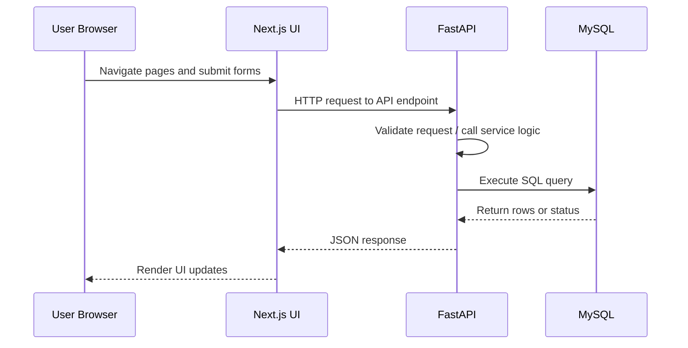
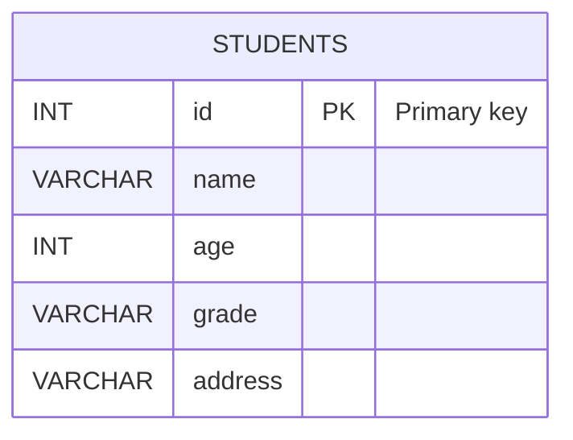

# Ira-FastAPI

## 1. Project Overview

`Ira-FastAPI` is a full-stack student management application built with a Next.js frontend and a FastAPI backend. The application enables creating, reading, updating, deleting, and listing student records stored in a MySQL database.

### Purpose

The project demonstrates a simple administrative interface for managing student details with:

- A responsive Next.js UI for student listing, creation, and detail editing.
- A FastAPI backend exposing REST endpoints for CRUD operations.
- A MySQL database for persistent student storage.

### High-level architecture

```mermaid
flowchart TB

    A["👤 User<br/>Accesses Student Management Portal"] --> B["🌐 Next.js Frontend"]

    subgraph Frontend["Frontend Layer (Next.js)"]
        B --> C["Students List Page<br/>/students"]
        B --> D["Create Student Page<br/>/create"]
        B --> E["Student Details Page<br/>/read/[id]"]
    end

    C --> F["Fetch Student Records"]
    D --> G["Submit Student Form"]
    E --> H["Read / Update / Delete Student"]

    F --> I["FastAPI API Layer"]
    G --> I
    H --> I

    subgraph Backend["Backend Layer (FastAPI)"]

        I --> J["API Router"]

        J --> K["GET /students<br/>Retrieve All Students"]

        J --> L["POST /create<br/>Create Student"]

        J --> M["GET /read<br/>Get Student By ID"]

        J --> N["PUT /update<br/>Update Student"]

        J --> O["DELETE /delete<br/>Delete Student"]

        K --> P["Pydantic Validation"]
        L --> P
        M --> P
        N --> P
        O --> P

        P --> Q["Student Service Functions<br/>functions/students.py"]

    end

    subgraph DatabaseLayer["Database Layer"]

        Q --> R["MySQL Connection<br/>database.py"]

        R --> S["Students Table"]

        S --> T["Execute SQL Queries"]

        T --> U["INSERT Student"]
        T --> V["SELECT Student(s)"]
        T --> W["UPDATE Student"]
        T --> X["DELETE Student"]

    end

    U --> Y["Query Result"]
    V --> Y
    W --> Y
    X --> Y

    Y --> Z["JSON Response Generated"]

    Z --> AA["HTTP Response Returned"]

    AA --> AB["Next.js Updates UI"]

    AB --> AC["User Sees Updated Data"]

    P --> AD["Validation Error"]

    AD --> AE["422 Validation Response"]


### Key features

- Frontend student dashboard with search and navigation
- Create student records via form submission
- Read student details by ID
- Update student data in-place
- Delete student records
- List all students from the database
- FastAPI validation using Pydantic
- CORS enabled for frontend-backend access

---

## 2. Tech Stack

| Layer | Technology |
|---|---|
| Frontend | Next.js (JSX) |
| Backend | FastAPI |
| Database | MySQL |
| ORM / Database Layer | Direct SQL via `mysql.connector` (no ORM) |
| Authentication | Not implemented in the current codebase |
| Deployment | Not implemented in the current codebase |

---

## 3. Project Structure

```
Ira-FastAPI/
├── backend/
│   ├── database.py
│   ├── functions/
│   │   └── students.py
│   ├── main.py
│   ├── requirements.txt
│   └── schema/
│       └── student.py
├── my-app/
│   ├── app/
│   │   ├── create/page.jsx
│   │   ├── read/[id]/page.jsx
│   │   ├── students/page.jsx
│   │   ├── page.js
│   │   └── layout.js
│   ├── components/
│   │   └── ui/table.jsx
│   ├── lib/
│   │   └── utils.js
│   ├── next.config.mjs
│   ├── package.json
│   ├── package-lock.json
│   ├── postcss.config.mjs
│   └── README.md
└── README.md
```

### Folder purposes

- `backend/` - FastAPI backend application source and database connectivity.
- `backend/main.py` - FastAPI app, route definitions, CORS middleware, and validation error handling.
- `backend/functions/students.py` - CRUD functions, SQL query execution, and MySQL interaction.
- `backend/schema/student.py` - Pydantic `Student` schema for request validation.
- `backend/database.py` - MySQL connection and cursor configuration.
- `backend/requirements.txt` - Python dependencies.
- `my-app/` - Next.js frontend application.
- `my-app/app/` - Next.js page routes and UI screens.
- `my-app/components/ui/table.jsx` - Reusable table UI component.
- `my-app/lib/utils.js` - Utility helper for class name merging.
- `my-app/package.json` - Frontend dependencies and scripts.

---

## 4. Installation & Setup

### Backend Setup

#### Python version

Use Python 3.10 or later.

#### Virtual environment creation

```powershell
cd d:\Ira-FastAPI\backend
python -m venv venv
```

Activate the environment:

```powershell
# PowerShell
.\venv\Scripts\Activate.ps1

#bash 
source venv/Scripts/activate

# Command Prompt
venv\Scripts\activate
```

#### Dependency installation

```powershell
pip install -r requirements.txt
```

#### Environment variables

Not implemented in the current codebase.

The backend currently reads hard-coded database configuration from `backend/database.py`.

#### Database migration/setup

Create the MySQL database and table manually:

```sql
CREATE DATABASE IF NOT EXISTS school_management;
USE school_management;

CREATE TABLE students (
  id INT PRIMARY KEY,
  name VARCHAR(255) NOT NULL,
  age INT NOT NULL,
  grade VARCHAR(100) NOT NULL,
  address VARCHAR(255) NOT NULL
);
```

#### Starting FastAPI server

```powershell
uvicorn main:app --reload --host 0.0.0.0 --port 8000
```

---

### Frontend Setup

#### Node.js version

Use Node.js 18 or later.

#### Install dependencies

```powershell
cd d:\Ira-FastAPI\my-app
npm install
```

#### Environment variables

Not implemented in the current codebase.

The frontend currently uses hard-coded backend URLs like `http://localhost:8000`.

#### Starting Next.js app

```powershell
npm run dev
```

Open the app at `http://localhost:3000`.

---

### MySQL Setup

#### Database creation

Use the SQL statements shown above to create the database and `students` table.

#### Connection configuration

The current backend connection settings are hard-coded in `backend/database.py`:

- host: `localhost`
- user: `Laksh`
- password: `Laksh22@gmail`
- database: `school_management`

Update these values directly in `database.py` or refactor to environment variables for production use.

---

## 5. Environment Variables

### Backend

Not implemented in the current codebase. Database and backend configuration are hard-coded in `backend/database.py`.

### Frontend

Not implemented in the current codebase. API fetch URLs are hard-coded in frontend pages.

---

## 6. Application Workflow

The overall flow of the application is:

1. User accesses the Next.js UI in the browser.
2. Next.js pages call FastAPI endpoints via `fetch`.
3. FastAPI request handlers validate input and dispatch to CRUD functions.
4. CRUD functions in `backend/functions/students.py` execute SQL against MySQL.
5. MySQL returns stored data.
6. FastAPI serializes the response and sends JSON back to the frontend.



---

## 7. API Documentation

### Endpoint: `GET /`

- Description: Root health check endpoint.
- Authentication: None
- Request parameters: None
- Query parameters: None
- Request body: None
- Response body:

```json
{
  "message": "Hello World"
}
```

#### Sample request

```bash
curl http://localhost:8000/
```

---

### Endpoint: `POST /create`

- Description: Create a new student record.
- Authentication: None
- Request parameters: None
- Query parameters: None
- Request body schema:

```json
{
  "id": 1,
  "name": "Jane Doe",
  "age": 18,
  "grade": "12",
  "address": "123 Main St"
}
```

- Response body on success:

```json
{
  "message": "Student created successfully"
}
```

#### Sample request

```bash
curl -X POST http://localhost:8000/create \
  -H "Content-Type: application/json" \
  -d '{"id": 1, "name": "Jane Doe", "age": 18, "grade": "12", "address": "123 Main St"}'
```

---

### Endpoint: `GET /read`

- Description: Retrieve a single student record by ID.
- Authentication: None
- Request parameters: None
- Query parameters:
  - `student_id` (int) required
- Request body: None
- Response body on success:

```json
{
  "id": 1,
  "name": "Jane Doe",
  "age": 18,
  "grade": "12",
  "address": "123 Main St"
}
```

- Response when not found:

```json
{
  "message": "Student not found"
}
```

#### Sample request

```bash
curl "http://localhost:8000/read?student_id=1"
```

---

### Endpoint: `PUT /update`

- Description: Update an existing student record.
- Authentication: None
- Request parameters: None
- Query parameters: None
- Request body schema:

```json
{
  "id": 1,
  "name": "Jane Doe",
  "age": 19,
  "grade": "12",
  "address": "456 Elm St"
}
```

- Response body on success:

```json
{
  "message": "Student updated successfully"
}
```

#### Sample request

```bash
curl -X PUT http://localhost:8000/update \
  -H "Content-Type: application/json" \
  -d '{"id": 1, "name": "Jane Doe", "age": 19, "grade": "12", "address": "456 Elm St"}'
```

---

### Endpoint: `DELETE /delete`

- Description: Delete a student record by ID.
- Authentication: None
- Request parameters: None
- Query parameters:
  - `student_id` (int) required
- Request body: None
- Response body on success:

```json
{
  "message": "Student deleted successfully"
}
```

#### Sample request

```bash
curl -X DELETE "http://localhost:8000/delete?student_id=1"
```

---

### Endpoint: `GET /students`

- Description: Retrieve all student records.
- Authentication: None
- Request parameters: None
- Query parameters: None
- Request body: None
- Response body on success:

```json
[
  {
    "id": 1,
    "name": "Jane Doe",
    "age": 18,
    "grade": "12",
    "address": "123 Main St"
  }
]
```

#### Sample request

```bash
curl http://localhost:8000/students
```

---

## 8. Complete API Inventory

| Method | Endpoint | Description | Auth Required |
|---|---|---|---|
| GET | `/` | Health check | No |
| POST | `/create` | Create a student | No |
| GET | `/read` | Read student by ID | No |
| PUT | `/update` | Update student | No |
| DELETE | `/delete` | Delete student by ID | No |
| GET | `/students` | List all students | No |

---

## 9. Frontend Pages & Components

### Pages

| Page route | Purpose |
|---|---|
| `/` | Landing page and entry point to the student portal |
| `/students` | Displays a searchable list of students and navigation to create new students |
| `/create` | Form page for creating a new student record |
| `/read/[id]` | Student detail page with edit and delete actions |

### Reusable components

- `my-app/components/ui/table.jsx` - Reusable table component for rendering student lists.
- `my-app/lib/utils.js` - Utility helper for merging CSS class names.

### State management

- The frontend uses React `useState` and `useEffect` for local state.
- No global state management library is used.
- Student data is fetched per page from the backend on component mount.

### API integration flow

- `create/page.jsx` posts JSON to `http://localhost:8000/create`.
- `students/page.jsx` fetches the student list from `http://localhost:8000/students`.
- `read/[id]/page.jsx` reads, updates, and deletes student records using `read`, `update`, and `delete` endpoints.

---

## 10. Database Documentation

### Table: `students`

| Column | Type | Description |
|---|---|---|
| `id` | INT | Primary key and unique student identifier |
| `name` | VARCHAR | Student full name |
| `age` | INT | Student age |
| `grade` | VARCHAR | Student grade level |
| `address` | VARCHAR | Student address |

### Relationships

- No foreign key relationships exist.
- The database model contains a single table only.

### Constraints

- `id` is the primary key.
- All fields are required in the current backend logic.

### ERD



---

## 11. Authentication & Authorization

Not implemented in the current codebase.

- No JWT flow exists.
- No OAuth flow exists.
- No API key flow exists.
- No session-based or role-based authorization exists.

---

## 12. Error Handling

### 400 Bad Request

Returned when creating a student with an existing ID:

```json
{
  "detail": "Student ID 1 already exists"
}
```

### 401 Unauthorized

Not implemented in the current codebase.

### 403 Forbidden

Not implemented in the current codebase.

### 404 Not Found

Not implemented as a dedicated response format in the current codebase.

### 422 Validation Error

Returned by FastAPI request validation:

```json
{
  "detail": [
    {
      "loc": ["body", "name"],
      "msg": "field required",
      "type": "value_error.missing"
    }
  ],
  "body": null
}
```

### 500 Internal Server Error

Not explicitly handled in the current codebase. FastAPI default error response will apply for unhandled exceptions.

---

## 13. Assumptions & Limitations

- Backend configuration values are hard-coded in `backend/database.py`.
- The frontend uses hard-coded `http://localhost:8000` API endpoints.
- No environment variables are implemented.
- No authentication or authorization is present.
- No database migration tools are defined.
- Direct SQL queries are used instead of an ORM.
- Production deployment configuration is not provided.
- Error handling is limited to FastAPI validation and duplicate-ID handling.

---

## 14. Postman Collection

A Postman collection is included in `PostmanCollection.json`.

### Collection contents

- `GET /`
- `POST /create`
- `GET /read`
- `PUT /update`
- `DELETE /delete`
- `GET /students`

### Variables

- `base_url` = `http://localhost:8000`

### Authentication setup

Not required.

### Import instructions

1. Open Postman.
2. Choose `Import`.
3. Select `PostmanCollection.json` from the project root.
4. Set `base_url` to `http://localhost:8000` if needed.

---

## 15. Submission Readiness Checklist

- [x] README completed
- [x] APIs documented
- [x] Setup guide included
- [x] Error responses documented
- [x] Postman collection generated
- [x] Environment variables section included


    AE --> AB
```
