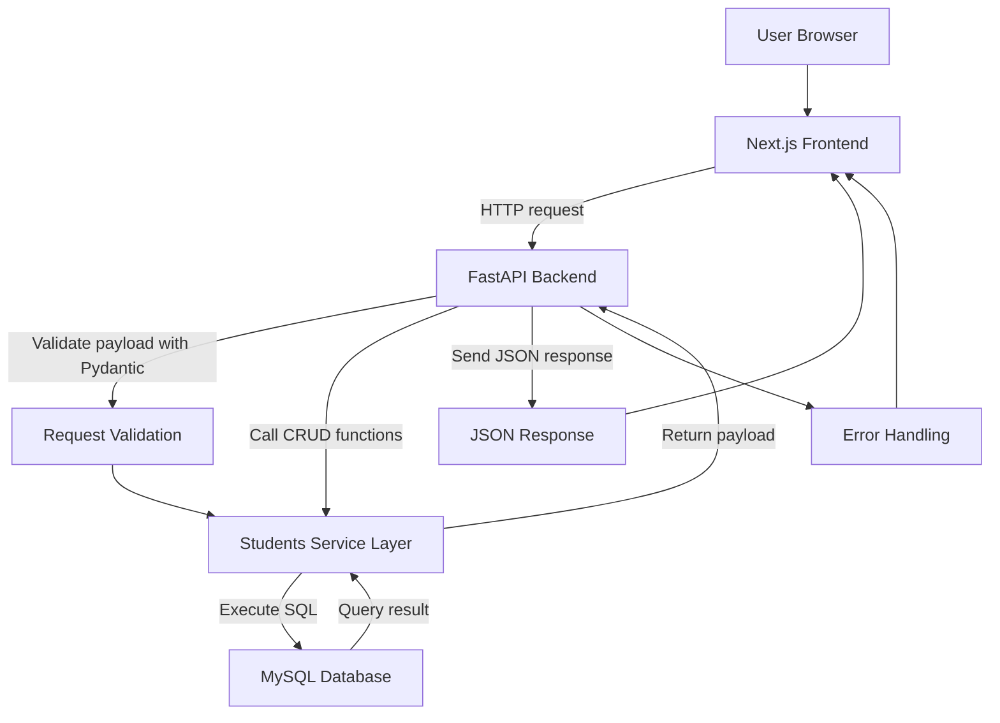
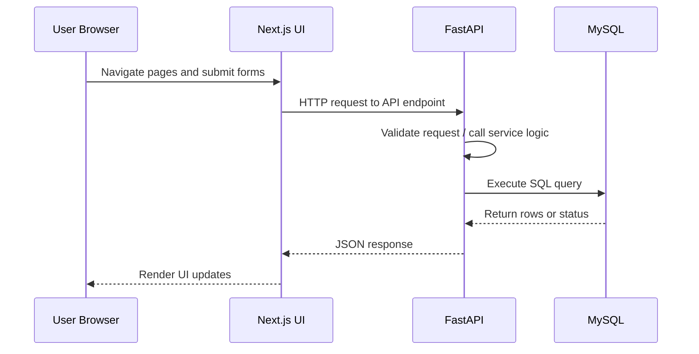
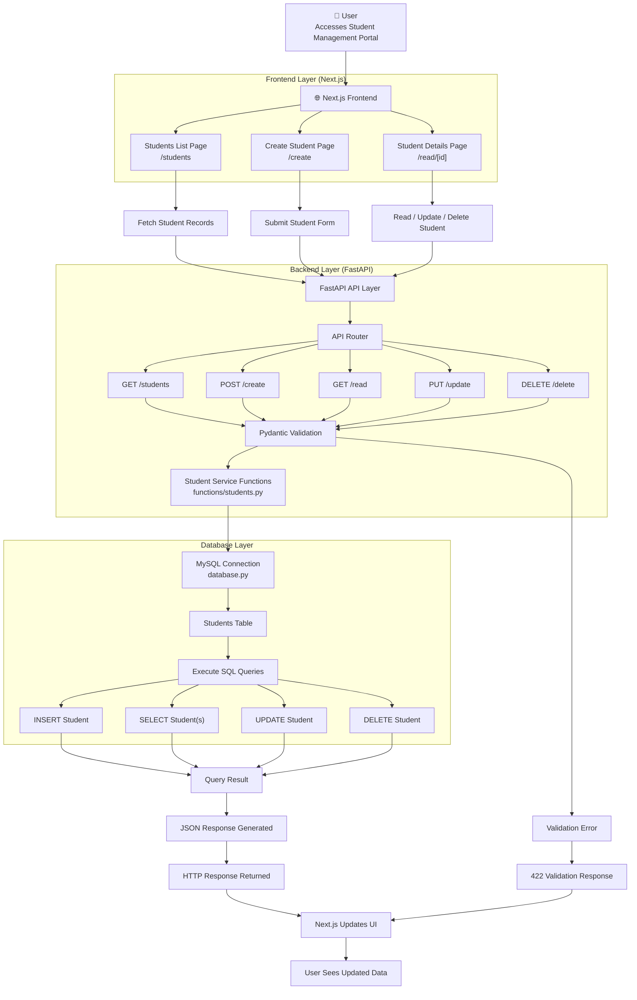
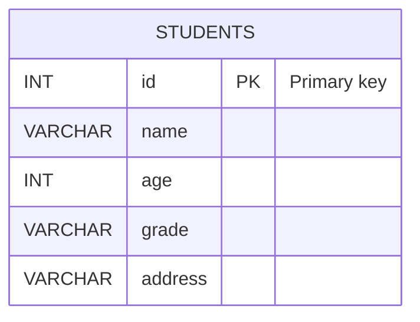

# Ira-FastAPI — Student Management System

A full-stack student management application built with a **Next.js** frontend, **FastAPI** backend, and **MySQL** database. The application enables creating, reading, updating, deleting, and listing student records through a responsive web interface.

---

## Table of Contents

- [Project Overview](#1-project-overview)
- [Tech Stack](#2-tech-stack)
- [Project Structure](#3-project-structure)
- [Installation & Setup](#4-installation--setup)
- [Environment Variables](#5-environment-variables)
- [Application Workflow](#6-application-workflow)
- [API Documentation](#7-api-documentation)
- [Complete API Inventory](#8-complete-api-inventory)
- [Frontend Pages & Components](#9-frontend-pages--components)
- [Database Documentation](#10-database-documentation)
- [Authentication & Authorization](#11-authentication--authorization)
- [Error Handling](#12-error-handling)
- [Assumptions & Limitations](#13-assumptions--limitations)
- [Postman Collection](#14-postman-collection)
- [Submission Readiness Checklist](#15-submission-readiness-checklist)

---

## 1. Project Overview

`Ira-FastAPI` demonstrates a simple administrative interface for managing student details with:

- A responsive Next.js UI for student listing, creation, and detail editing.
- A FastAPI backend exposing REST endpoints for CRUD operations.
- A MySQL database for persistent student storage.

### High-level Architecture

```mermaid
graph LR
  A[Next.js Frontend] -->|HTTP requests| B[FastAPI Backend]
  B -->|MySQL Connector / SQL| C[MySQL Database]
  A -->|UI pages| D[Create / read / students Pages]
  B -->|Routes| E[/create, /read, /update, /delete, /students]
```

### Detailed Application Flowchart



### Key Features

- Frontend student dashboard with search and navigation
- Create student records via form submission
- Read student details by ID
- Update student data in-place
- Delete student records
- List all students from the database
- FastAPI validation using Pydantic
- CORS enabled for frontend-backend access

---

## 2. Tech Stack

| Layer | Technology |
|---|---|
| Frontend | Next.js (JSX) |
| Backend | FastAPI |
| Database | MySQL |
| ORM / Database Layer | Direct SQL via `mysql.connector` (no ORM) |
| Authentication | Not implemented |
| Deployment | Not implemented |

---

## 3. Project Structure

```
Ira-FastAPI/
├── backend/
│   ├── database.py
│   ├── functions/
│   │   └── students.py
│   ├── main.py
│   ├── requirements.txt
│   └── schema/
│       └── student.py
├── my-app/
│   ├── app/
│   │   ├── create/page.jsx
│   │   ├── read/[id]/page.jsx
│   │   ├── students/page.jsx
│   │   ├── page.js
│   │   └── layout.js
│   ├── components/
│   │   └── ui/table.jsx
│   ├── lib/
│   │   └── utils.js
│   ├── next.config.mjs
│   ├── package.json
│   ├── package-lock.json
│   ├── postcss.config.mjs
│   └── README.md
└── README.md
```

### Folder Purposes

| Path | Purpose |
|---|---|
| `backend/` | FastAPI backend application source and database connectivity |
| `backend/main.py` | FastAPI app, route definitions, CORS middleware, and validation error handling |
| `backend/functions/students.py` | CRUD functions, SQL query execution, and MySQL interaction |
| `backend/schema/student.py` | Pydantic `Student` schema for request validation |
| `backend/database.py` | MySQL connection and cursor configuration |
| `backend/requirements.txt` | Python dependencies |
| `my-app/` | Next.js frontend application |
| `my-app/app/` | Next.js page routes and UI screens |
| `my-app/components/ui/table.jsx` | Reusable table UI component |
| `my-app/lib/utils.js` | Utility helper for class name merging |
| `my-app/package.json` | Frontend dependencies and scripts |

---

## 4. Installation & Setup

### Backend Setup

**Requirements:** Python 3.10 or later

```bash
cd d:\Ira-FastAPI\backend
python -m venv venv
```

Activate the virtual environment:

```bash
# PowerShell
.\venv\Scripts\Activate.ps1

# Bash
source venv/Scripts/activate

# Command Prompt
venv\Scripts\activate
```

Install dependencies:

```bash
pip install -r requirements.txt
```

Set up the database (see [MySQL Setup](#mysql-setup) below), then start the server:

```bash
uvicorn main:app --reload --host 0.0.0.0 --port 8000
```

The API will be available at `http://localhost:8000`.

---

### Frontend Setup

**Requirements:** Node.js 18 or later

```bash
cd d:\Ira-FastAPI\my-app
npm install
npm run dev
```

The app will be available at `http://localhost:3000`.

---

### MySQL Setup

Create the database and table manually:

```sql
CREATE DATABASE IF NOT EXISTS school_management;
USE school_management;

CREATE TABLE students (
  id      INT PRIMARY KEY,
  name    VARCHAR(255) NOT NULL,
  age     INT NOT NULL,
  grade   VARCHAR(100) NOT NULL,
  address VARCHAR(255) NOT NULL
);
```

Update the connection settings in `backend/database.py` to match your credentials:

```python
host     = "localhost"
user     = "your_user"
password = "your_password"
database = "school_management"
```

> **Note:** The current codebase has these values hard-coded. Refactor to environment variables before deploying to production.

---

## 5. Environment Variables

### Backend

Not implemented. Database configuration is hard-coded in `backend/database.py`.

### Frontend

Not implemented. API fetch URLs are hard-coded as `http://localhost:8000` in the frontend pages.

---

## 6. Application Workflow



1. User accesses the Next.js UI in the browser.
2. Next.js pages call FastAPI endpoints via `fetch`.
3. FastAPI request handlers validate input and dispatch to CRUD functions.
4. CRUD functions in `backend/functions/students.py` execute SQL against MySQL.
5. MySQL returns stored data.
6. FastAPI serializes the response and sends JSON back to the frontend.

### Full System Flowchart



---

## 7. API Documentation

Base URL: `http://localhost:8000`

---

### `GET /`

Health check endpoint.

**Response:**
```json
{ "message": "Hello World" }
```

**Sample request:**
```bash
curl http://localhost:8000/
```

---

### `POST /create`

Create a new student record.

**Request body:**
```json
{
  "id": 1,
  "name": "Jane Doe",
  "age": 18,
  "grade": "12",
  "address": "123 Main St"
}
```

**Response:**
```json
{ "message": "Student created successfully" }
```

**Sample request:**
```bash
curl -X POST http://localhost:8000/create \
  -H "Content-Type: application/json" \
  -d '{"id": 1, "name": "Jane Doe", "age": 18, "grade": "12", "address": "123 Main St"}'
```

---

### `GET /read`

Retrieve a single student record by ID.

**Query parameters:**

| Parameter | Type | Required |
|---|---|---|
| `student_id` | int | Yes |

**Response (found):**
```json
{
  "id": 1,
  "name": "Jane Doe",
  "age": 18,
  "grade": "12",
  "address": "123 Main St"
}
```

**Response (not found):**
```json
{ "message": "Student not found" }
```

**Sample request:**
```bash
curl "http://localhost:8000/read?student_id=1"
```

---

### `PUT /update`

Update an existing student record. All fields must be supplied.

**Request body:**
```json
{
  "id": 1,
  "name": "Jane Doe",
  "age": 19,
  "grade": "12",
  "address": "456 Elm St"
}
```

**Response:**
```json
{ "message": "Student updated successfully" }
```

**Sample request:**
```bash
curl -X PUT http://localhost:8000/update \
  -H "Content-Type: application/json" \
  -d '{"id": 1, "name": "Jane Doe", "age": 19, "grade": "12", "address": "456 Elm St"}'
```

---

### `DELETE /delete`

Delete a student record by ID.

**Query parameters:**

| Parameter | Type | Required |
|---|---|---|
| `student_id` | int | Yes |

**Response:**
```json
{ "message": "Student deleted successfully" }
```

**Sample request:**
```bash
curl -X DELETE "http://localhost:8000/delete?student_id=1"
```

---

### `GET /students`

Retrieve all student records.

**Response:**
```json
[
  {
    "id": 1,
    "name": "Jane Doe",
    "age": 18,
    "grade": "12",
    "address": "123 Main St"
  }
]
```

**Sample request:**
```bash
curl http://localhost:8000/students
```

---

## 8. Complete API Inventory

| Method | Endpoint | Description | Auth Required |
|---|---|---|---|
| GET | `/` | Health check | No |
| POST | `/create` | Create a student | No |
| GET | `/read` | Read student by ID | No |
| PUT | `/update` | Update student | No |
| DELETE | `/delete` | Delete student by ID | No |
| GET | `/students` | List all students | No |

---

## 9. Frontend Pages & Components

### Pages

| Route | Purpose |
|---|---|
| `/` | Landing page and entry point to the student portal |
| `/students` | Searchable list of students with navigation to create new students |
| `/create` | Form page for creating a new student record |
| `/read/[id]` | Student detail page with edit and delete actions |

### Reusable Components

| File | Purpose |
|---|---|
| `my-app/components/ui/table.jsx` | Reusable table component for rendering student lists |
| `my-app/lib/utils.js` | Utility helper for merging CSS class names |

### State Management

- The frontend uses React `useState` and `useEffect` for local state.
- No global state management library is used.
- Student data is fetched per page from the backend on component mount.

### API Integration Flow

| Page | API Call |
|---|---|
| `create/page.jsx` | `POST http://localhost:8000/create` |
| `students/page.jsx` | `GET http://localhost:8000/students` |
| `read/[id]/page.jsx` | `GET /read`, `PUT /update`, `DELETE /delete` |

---

## 10. Database Documentation

### Table: `students`

| Column | Type | Description |
|---|---|---|
| `id` | INT | Primary key — unique student identifier |
| `name` | VARCHAR(255) | Student full name |
| `age` | INT | Student age |
| `grade` | VARCHAR(100) | Student grade level |
| `address` | VARCHAR(255) | Student address |

### Relationships

- No foreign key relationships exist.
- The database model contains a single table only.

### Constraints

- `id` is the primary key.
- All fields are required in the current backend logic.

### ERD



---

## 11. Authentication & Authorization

Not implemented in the current codebase.

- No JWT flow exists.
- No OAuth flow exists.
- No API key flow exists.
- No session-based or role-based authorization exists.

---

## 12. Error Handling

| Status | Scenario | Example Response |
|---|---|---|
| `400 Bad Request` | Creating a student with a duplicate ID | `{"detail": "Student ID 1 already exists"}` |
| `401 Unauthorized` | Not implemented | — |
| `403 Forbidden` | Not implemented | — |
| `404 Not Found` | No dedicated handler; returns message string | `{"message": "Student not found"}` |
| `422 Unprocessable Entity` | Pydantic validation failure | See below |
| `500 Internal Server Error` | Unhandled exception | FastAPI default response |

**422 Validation Error example:**
```json
{
  "detail": [
    {
      "loc": ["body", "name"],
      "msg": "field required",
      "type": "value_error.missing"
    }
  ],
  "body": null
}
```

---

## 13. Assumptions & Limitations

- Backend configuration values are hard-coded in `backend/database.py`.
- The frontend uses hard-coded `http://localhost:8000` API endpoints.
- No environment variables are implemented.
- No authentication or authorization is present.
- No database migration tools are defined.
- Direct SQL queries are used instead of an ORM.
- Production deployment configuration is not provided.
- Error handling is limited to FastAPI validation and duplicate-ID checks.

---

## 14. Postman Collection

A Postman collection is included as `PostmanCollection.json` in the project root.

### Collection Contents

- `GET /`
- `POST /create`
- `GET /read`
- `PUT /update`
- `DELETE /delete`
- `GET /students`

**Variable:** `base_url` = `http://localhost:8000`

**Authentication:** Not required.

### Import Instructions

1. Open Postman.
2. Click **Import**.
3. Select `PostmanCollection.json` from the project root.
4. Set `base_url` to `http://localhost:8000` if needed.

---

## 15. Submission Readiness Checklist

- [x] README completed
- [x] APIs documented
- [x] Setup guide included
- [x] Error responses documented
- [x] Postman collection generated
- [x] Environment variables section included
