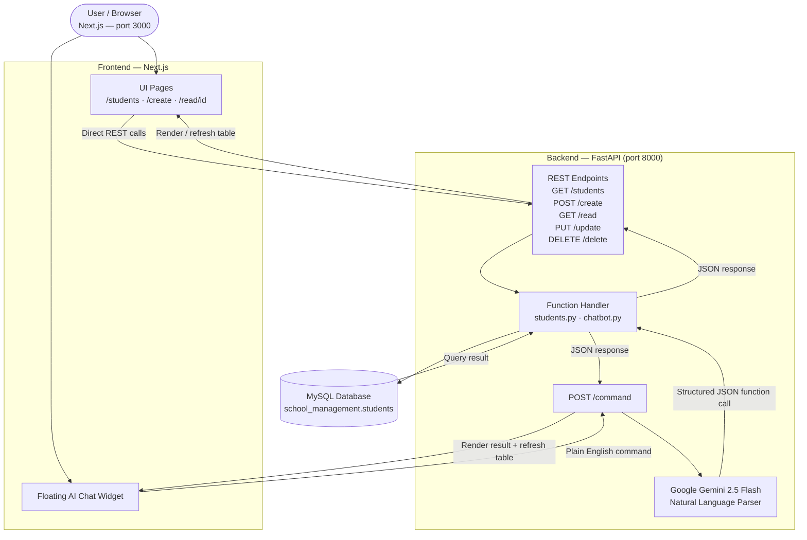

# Ira-FastAPI — Student Management System

A full-stack student management app with a **Next.js** frontend, **FastAPI** backend, and **MySQL** database. Includes an AI-powered floating chat assistant that takes plain English commands and runs them instantly.

---

## Table of Contents

1. [Project Overview](#1-project-overview)
2. [Tech Stack](#2-tech-stack)
3. [Project Structure](#3-project-structure)
4. [Installation & Setup](#4-installation--setup)
5. [Environment Variables](#5-environment-variables)
6. [API Documentation](#6-api-documentation)
7. [AI Chat Interface](#7-ai-chat-interface)
8. [Database](#8-database)
9. [Frontend Pages](#9-frontend-pages)
10. [Error Handling](#10-error-handling)
11. [Assumptions & Limitations](#11-assumptions--limitations)

---

## 1. Project Overview

Ira-FastAPI is an admin portal for managing student records. The core workflow:

- View, search, create, edit, and delete students through a clean web UI
- Use the **floating AI assistant** on the students page to do anything in plain English
- The backend parses the command using **Google Gemini**, runs the right database query, and sends back a result the frontend shows instantly

### Architecture

```
Next.js (port 3000)
      │
      │  HTTP / REST
      ▼
FastAPI (port 8000)
      │
      ├── /students, /create, /read, /update, /delete  ← direct REST
      └── /command  ← plain English → Gemini → database
              │
              ▼
         MySQL Database
```

### Architecture Flowchart



### Key Features

| Feature | Detail |
|---|---|
| Student CRUD | Create, read, update, delete via form UI or AI chat |
| 25+ AI functions | Covers everything from search to bulk edits to analytics |
| Bulk operations | Update or delete many students at once using a filter |
| Analytics | Average age, grade breakdown, oldest, youngest, grouping by city |
| Smart updates | Chat only changes the fields you mention — the rest stay as they are |
| Live table refresh | Table updates automatically after every chat command |
| Help command | Type "help" in chat to see all available commands with examples |
| Search | Filter the table by name, grade, or ID instantly |

---

## 2. Tech Stack

| Layer | Technology |
|---|---|
| Frontend | Next.js 14 (App Router, JSX) |
| Backend | FastAPI (Python) |
| Database | MySQL |
| DB Driver | `mysql.connector` (no ORM, raw SQL) |
| AI Parser | Google Gemini 2.5 Flash via `google-genai` |
| Styling | Inline styles + Tailwind utility classes |

---

## 3. Project Structure

```
Ira-FastAPI/
├── backend/
│   ├── main.py                  # FastAPI app, routes, CORS, error handlers
│   ├── database.py              # MySQL connection
│   ├── requirements.txt
│   ├── .env                     # DB credentials + Gemini key (not committed)
│   ├── functions/
│   │   ├── students.py          # Core SQL functions
│   │   ├── parser.py            # Gemini parser + system prompt
│   │   └── chatbot.py           # Routes commands to the right function
│   └── schema/
│       └── student.py           # Pydantic Student model
│
└── my-app/
    ├── app/
    │   ├── page.js              # Landing page
    │   ├── layout.js
    │   ├── students/page.jsx    # Main table + floating AI chat
    │   ├── create/page.jsx      # Add student form
    │   └── read/[id]/page.jsx   # Student detail / edit / delete
    ├── components/
    │   └── ui/table.jsx
    ├── lib/utils.js
    └── package.json
```

---

## 4. Installation & Setup

### Prerequisites

- Python 3.10+
- Node.js 18+
- MySQL 8+

### Backend

```bash
cd backend
python -m venv venv

source venv/Scripts/activate      # Mac / Linux / WSL
.\venv\Scripts\Activate.ps1       # PowerShell
venv\Scripts\activate             # CMD

pip install -r requirements.txt
```

Create `.env` (see [Environment Variables](#5-environment-variables)), set up MySQL (see below), then:

```bash
uvicorn main:app --reload --host 0.0.0.0 --port 8000
```

### MySQL Setup

```sql
CREATE DATABASE IF NOT EXISTS school_management;
USE school_management;

CREATE TABLE students (
  id       INT PRIMARY KEY AUTO_INCREMENT,
  roll_no  VARCHAR(255) NOT NULL UNIQUE,
  name     VARCHAR(255) NOT NULL,
  age      INT          NOT NULL,
  grade    VARCHAR(100) NOT NULL,
  address  VARCHAR(255) NOT NULL
);
```

### Frontend

```bash
cd my-app
npm install
npm run dev
```

App runs at `http://localhost:3000`.

---

## 5. Environment Variables

Create `backend/.env`:

```env
DATABASE_PASSWORD=your_mysql_password
GEMINI_API_KEY=your_gemini_api_key
```

| Variable | Required | Description |
|---|---|---|
| `DATABASE_PASSWORD` | Yes | MySQL password used in `database.py` |
| `GEMINI_API_KEY` | Yes | Google Gemini API key for the AI parser |

> The frontend talks to `http://localhost:8000` by default. To change this, update `API_BASE` at the top of `students/page.jsx` and `read/[id]/page.jsx`.

---

## 6. API Documentation

Base URL: `http://localhost:8000`

### `GET /`
Health check.
```json
{ "message": "Hello World" }
```

### `POST /create`
Add a new student.

**Body:**
```json
{ "roll_no": "A101", "name": "Laksh", "age": 18, "grade": "A", "address": "Vasai" }
```
**Response:**
```json
{ "message": "Student created successfully" }
```

### `GET /read?student_id=1`
Get one student by ID.

**Response (found):**
```json
{ "id": 1, "roll_no": "A101", "name": "Laksh", "age": 18, "grade": "A", "address": "Vasai" }
```
**Response (not found):**
```json
{ "message": "Student not found" }
```

### `PUT /update`
Update a student — all fields required.

**Body:**
```json
{ "id": 1, "roll_no": "A101", "name": "Laksh", "age": 19, "grade": "A", "address": "Virar" }
```
**Response:**
```json
{ "message": "Student updated successfully" }
```

> To update only one field (e.g. just the grade), use `/command` instead.

### `DELETE /delete?student_id=1`
```json
{ "message": "Student deleted successfully" }
```

### `GET /students`
Get all students.
```json
[
  { "id": 1, "roll_no": "A101", "name": "Laksh", "age": 18, "grade": "A", "address": "Vasai" }
]
```

### `POST /command`
Send a plain English command. Gemini figures out what to do and runs it.

**Body:**
```json
{ "command": "delete all students with grade F" }
```
**Response:**
```json
{
  "success": true,
  "message": "Deleted 3 students where grade=F",
  "navigate": { "path": "/students" },
  "details": [
    {
      "function": "deletewhere",
      "success": true,
      "message": "Deleted 3 students where grade=F",
      "result": { "deleted": 3 }
    }
  ]
}
```

---

## 7. AI Chat Interface

The floating chat widget is in the bottom-right corner of the `/students` page.

### How it works

```
User types a command
      │
      ▼
POST /command
      │
      ▼
parser.py sends it to Gemini 2.5 Flash
      │   Gemini returns a JSON function call
      ▼
chatbot.py runs the right function against the database
      │
      ▼
{ success, message, navigate, details }
      │
      ▼
Frontend shows the result and refreshes the table
```

### All 25+ supported functions

#### CRUD — basic operations
| Function | Example prompt |
|---|---|
| `add` | `add student roll A101 name Laksh age 20 grade A address Mumbai` |
| `get` | `get student 1` |
| `edit` | `update student 1 age to 21` |
| `remove` | `delete student 1` |

#### List & Filter
| Function | Example prompt |
|---|---|
| `all` | `show all students` |
| `filter` | `show students with grade A` |
| `advfilter` | `show students where grade is A and age is greater than 18` |
| `search` | `search students named ri` |
| `byroll` | `find student with roll number A101` |
| `exists` | `does student with roll A101 exist` |
| `duplicates` | `find duplicate names` |
| `sort` | `sort students by age descending` |
| `page` | `show page 1 with 5 students per page` |

#### Analytics
| Function | Example prompt |
|---|---|
| `count` | `how many students are there` |
| `avgage` | `what is the average age of grade A students` |
| `grades` | `show grade breakdown` |
| `oldest` | `who is the oldest grade A student` |
| `youngest` | `who is the youngest student older than 18` |
| `bycity` | `group students by city` |
| `top` | `show top students with grade B or better` |
| `summary` | `generate summary report` |

#### Bulk operations
| Function | Example prompt |
|---|---|
| `addmany` | `add students roll A102 name Riya age 21 grade B address Pune and roll A103 name Jay age 22 grade C address Delhi` |
| `editwhere` | `update all grade B students to grade A` |
| `deletewhere` | `delete all students with grade F` |
| `deleteall` | `delete all students` |
| `promote` | `promote all C grade students to B` |
| `addyear` | `add a year to all students age` |
| `setfield` | `set address to Delhi for all grade A students` |
| `swapgrade` | `swap grades between student 1 and student 2` |
| `archive` | `archive student 1` |

#### Utility
| Function | Example prompt |
|---|---|
| `help` | `help` / `what can you do` / `show features` |

### Smart update behaviour

When you say something like `update student 1 grade to A`, the system:
1. Fetches the full student record from the database
2. Replaces only the grade with the new value
3. Saves everything else exactly as it was

So you never accidentally lose a student's name, age, or address just because you only mentioned one field.

### oldest / youngest with extra conditions

Both `oldest` and `youngest` support an optional grade filter and age conditions together:

```
"youngest student"                       → all students
"youngest grade A student"               → only grade A students
"youngest grade A student older than 22" → grade A and age > 22
"oldest student under 25"                → age < 25 only
```

### Chat response format

Each response has a `details` array with one entry per operation run:

```json
{
  "function": "add",
  "success": true,
  "message": "Student created successfully",
  "navigate": { "path": "/students" },
  "result": { ... }
}
```

---

## 8. Database

### Table: `students`

| Column | Type | Constraints |
|---|---|---|
| `id` | INT | Primary key, auto-increment |
| `roll_no` | VARCHAR(255) | Not null, unique |
| `name` | VARCHAR(255) | Not null |
| `age` | INT | Not null |
| `grade` | VARCHAR(100) | Not null |
| `address` | VARCHAR(255) | Not null |

- Single table, no foreign keys
- All fields required for REST endpoints
- `archive` marks a student as inactive by setting their grade to `ARCHIVED`

---

## 9. Frontend Pages

| Route | Purpose |
|---|---|
| `/` | Landing page |
| `/students` | Student table with search, stats, and floating AI chat |
| `/create` | Form to add a new student |
| `/read/[id]` | Student detail with edit and delete |

### `/students` page

- Loads all students on open
- Search bar filters by name, grade, or ID as you type
- Clicking a row opens that student's detail page
- Table refreshes automatically after any chat command that changes data
- Stats bar shows total students and how many are currently visible
- Chat shows rich results depending on the command — student cards for lists, a grade table for `grades`, city counts for `bycity`, a full stats block for `summary`, and clickable example commands for `help`

---

## 10. Error Handling

| Status | When it happens |
|---|---|
| `400` | A required field is missing, or the Gemini API key is invalid |
| `404` | Student not found during a REST read or update |
| `422` | Wrong data type or missing field in the request body |
| `500` | Something unexpected broke on the server |

Chat errors come back as HTTP 200 with `success: false` so the frontend can show them inline:

```json
{
  "success": false,
  "message": "Student 99 not found",
  "navigate": null,
  "details": [...]
}
```

---

## 11. Assumptions & Limitations

- No login or user authentication
- Database schema must be created manually — no migration tool
- Frontend is hard-coded to talk to `http://localhost:8000` — change `API_BASE` before deploying
- The form-based `PUT /update` needs all fields filled in; the chat handles partial updates
- The `/command` endpoint needs a working Gemini API key to function
- No rate limiting on `/command` — every message hits the Gemini API
- Bulk operations run one SQL query per student in a loop, not as a single transaction
- `archive` uses the grade column as a soft-delete flag; there is no separate active/inactive column
